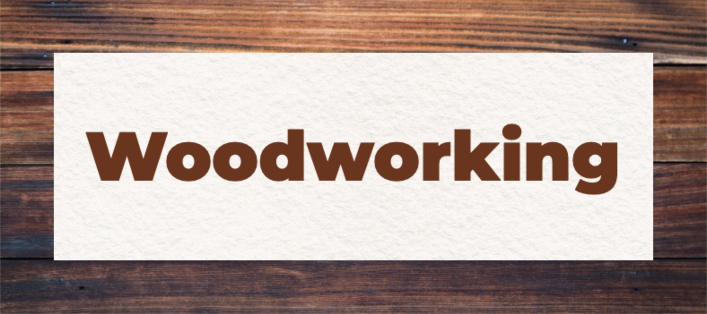
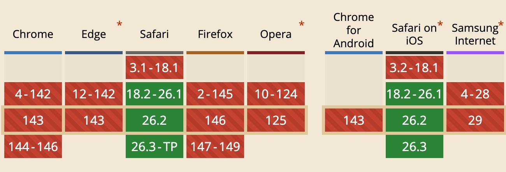
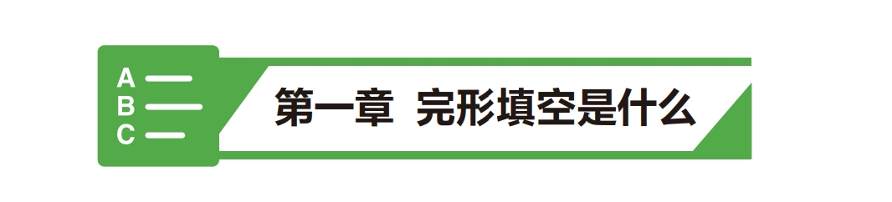

# CSS background-image 知识分享

> 本文档用于团队内部知识分享，涵盖 CSS background-image 的核心概念、实用技巧和最佳实践。

## 📋 目录

1. [核心属性详解](#核心属性详解)
2. [多背景图实战](#多背景图实战)
3. [最佳实践](#最佳实践)

---

## 📚 核心属性详解

### background-position

设置背景图片的位置，总是以容器的左上角为坐标原点对背景图片进行定位。

#### 三种类型的值

1. **数值**（可以是负值），直接指定背景图片的左上角相对于容器左上角的偏移量
   ```css
   background-position: 10px 20px;  /* 向右10px，向下20px */
   background-position: -10px -20px; /* 向左10px，向上20px */
   ```

2. **百分比**
   ```css
   background-position: 50% 50%;  /* 居中，背景图片正中心点与容器正中心点对齐 */
   background-position: 0% 0%;     /* 左上角，背景图片左上角与容器左上角对齐 */
   background-position: 100% 100%; /* 右下角，背景图片右下角与容器右下角对齐 */
   ```

3. **关键词**
   ```css
   background-position: left top;     /* 左上角 */
   background-position: top left /* ? */
   background-position: center center; /* 居中 */
   background-position: right bottom; /* 右下角 */
   background-position: bottom right; /* ? */
   ```

#### 百分比值的计算方式

**百分比值**：计算公式为 `(容器尺寸 - 背景图片尺寸) × 百分比值`

- 水平位置：`(容器宽度 - 背景图片宽度) × 百分比值`
- 垂直位置：`(容器高度 - 背景图片高度) × 百分比值`

**示例说明**：
- `0% 0%`：背景图片的左上角对齐容器的左上角
- `50% 50%`：背景图片的中心点对齐容器的中心点（居中）
- `100% 100%`：背景图片的右下角对齐容器的右下角


**⚠️ 注意**：背景图片是从内部补白（padding）边缘的左上角起到元素边框（border）的右下角边缘止；当background-repeate设置为repeate时，background-position的起始点是从元素的内部空白（padding）外边缘开始的。

**⚠️ 注意**：当背景图片尺寸大于容器尺寸时，百分比值会导致图片向相反方向偏移，就好像设置了负值。

**📖 示例演示**：[https://zhangdazongwei.github.io/css-study/background/examples/background-position.html](https://zhangdazongwei.github.io/css-study/background/examples/background-position.html)

### background-origin

设置背景图片定位的起点（即`background-position` 的参考原点）。

| 值 | 说明 |
|---|---|
| `padding-box` | 默认值，从 padding 的外边缘（border 的内边缘）开始 |
| `border-box` | 从 border 的外边缘开始 |
| `content-box` | 从 content 的外边缘（padding 内边缘）开始 |

**⚠️ 注意: 这只是更改背景图片左上角的参考位置，而不会裁剪图片（使用background-clip实现）。**

**📖 示例演示**：[https://zhangdazongwei.github.io/css-study/background/examples/background-origin.html](https://zhangdazongwei.github.io/css-study/background/examples/background-origin.html)

### background-clip

设置背景图片的裁剪区域。

| 值 | 说明 |
|---|---|
| `border-box` | 默认值，背景图超出边框的部分被裁剪 |
| `padding-box` | 背景图超出 padding 的部分被裁剪 |
| `content-box` | 背景图超出内容区域的部分被裁剪 |
| `text` | 背景图被裁剪到前景文本内，需要配合 `color: transparent` 使用才能看到效果 |
| `border-area` | 背景图被裁剪到边框绘制的区域内，考虑 `border-width` 和 `border-style`，但忽略 `border-color` 引入的透明度 |

**⚠️ 注意**：`border-area` 值会将背景绘制在（裁剪到）边框绘制的区域内，但是目前浏览器支持程度低，真实效果为：





**📖 示例演示**：[https://zhangdazongwei.github.io/css-study/background/examples/background-clip.html](https://zhangdazongwei.github.io/css-study/background/examples/background-clip.html)

### background-size

设置背景图片的尺寸。

| 值 | 说明 | 示例 |
|---|---|---|
| `auto` | 保持原始尺寸或按比例缩放 | `background-size: auto;` |
| `<length>` | 具体数值（px、em等），当设置了一个值时，则指定了背景图片的宽度，高度则按比例进行缩放 | `background-size: 100px 50px;` |
| `<percentage>` | 相对于容器（如果有内边距padding，还需要加上该值）的百分比，当设置了一个值时，则指定了背景图片的宽度，高度则按比例进行缩放 | `background-size: 50% 50%;` |
| `cover` | 将背景图片放大，以适合铺满整个容器，但可能使得背景图片失真、裁剪 | `background-size: cover;` |
| `contain` | 保持背景图片本身的宽高比例，将背景图片缩放到宽度或高度正好适应元素容器的区域 | `background-size: contain;` |

#### auto 的详细说明

**不同用法**：
- `background-size: auto`：保持图片的固有尺寸（原始尺寸）
- `background-size: auto 50px`：高度固定50px，宽度按比例自动计算
- `background-size: 100px auto`：宽度固定100px，高度按比例自动计算

**⚠️ 注意**：如果背景图片没有固定宽高，设置auto时就相当于contain；

**📖 示例演示**：[https://zhangdazongwei.github.io/css-study/background/examples/background-size.html](https://zhangdazongwei.github.io/css-study/background/examples/background-size.html)

### background-repeat

控制背景图片的重复方式。

| 值 | 说明 | 示例 |
|---|---|---|
| `repeat` | 默认值，X轴和Y轴同时平铺 | `background-repeat: repeat;` |
| `repeat-x` | 仅X轴平铺 | `background-repeat: repeat-x;` |
| `repeat-y` | 仅Y轴平铺 | `background-repeat: repeat-y;` |
| `no-repeat` | 不重复 | `background-repeat: no-repeat;` |
| `space` | 重复时留空白，保持图片宽高比 | `background-repeat: space;` |
| `round` | 重复时拉伸图片以填满空间 | `background-repeat: round;` |

**⚠️ 注意**：当设置为 `repeat` 时，无论 `background-origin` 和 `background-position` 如何设置，背景图都是从元素边框左上角到边框右下角。

**⚠️ 注意**：如果只设置一个值（且不是 `repeat-x` 或 `repeat-y`），该值会同时应用于水平和垂直方向。

#### space 值详解

根据 [MDN 文档](https://developer.mozilla.org/en-US/docs/Web/CSS/Reference/Properties/background-repeat)，`space` 值会让背景图片重复时**均匀分布**，在重复的图片之间留出空白，确保重复的图片保持其固有宽高比而不被裁剪。

**详细说明**：
- 图片会尽可能多地重复而不被裁剪
- **第一张和最后一张图片被固定在元素的两侧**，空白在图片之间均匀分布
- `background-position` 属性会被忽略，除非只能显示一张图片而不被裁剪
- **唯一会发生裁剪的情况**：当空间不足以显示一张图片时

**特点**：
- 图片不会被裁剪，保持原始宽高比
- 重复的图片之间会有均匀的空白间隔
- 如果背景绘制区域的宽高比与图片不同，或者尺寸不是背景图片尺寸的倍数，可能会有区域未被背景图覆盖（显示背景色）

**使用场景**：适合需要保持图片完整显示，且可以接受留白的场景。

#### round 值详解

根据 [MDN 文档](https://developer.mozilla.org/en-US/docs/Web/CSS/Reference/Properties/background-repeat)，`round` 值会让重复的背景图片**拉伸**以填满整个可用空间，而不裁剪图片。

**详细说明**：
- 随着允许的空间增大，重复的图片会拉伸（不留空隙），直到有足够空间添加另一张图片
- **这是唯一一个可能导致背景图片宽高比变形的 `<repeat-style>` 值**
- 当背景图片的宽高比与背景绘制区域的宽高比不同时，就会发生变形

**特点**：
- 图片会被拉伸以填满整个区域
- 可能会改变图片的宽高比，导致图片变形
- 如果背景绘制区域的宽高比与图片不同，图片会在两个方向上都被拉伸
- 当空间足够容纳额外的图片时，会自动添加更多重复

**计算方式**：
- 浏览器会计算需要重复多少次才能填满空间
- 然后将图片拉伸到合适的尺寸
- 例如：100px × 100px 的图片，在 1099px × 750px 的区域中，会重复 10 次（水平）× 7 次（垂直），每张图片被拉伸到 109.9px × 105px

**使用场景**：适合需要完全填满背景区域，且可以接受图片变形的场景。

**📖 示例演示**：[https://zhangdazongwei.github.io/css-study/background/examples/background-repeat.html](https://zhangdazongwei.github.io/css-study/background/examples/background-repeat.html)

### background-attachment

设置背景图片的附着方式。

| 值 | 说明 |
|---|---|
| `scroll` | 默认值，背景图随页面滚动 |
| `fixed` | 背景图固定不动（仅在 html 和 body 标签上生效） |

**📖 示例演示**：[https://zhangdazongwei.github.io/css-study/background/examples/background-attachment.html](https://zhangdazongwei.github.io/css-study/background/examples/background-attachment.html)

---

## 思考🤔

**需求**：页面的尺寸由 **216mm x 291mm** 变为 **191mm x 266mm**，背景图应该如何适配？

**📖 示例演示**：[https://zhangdazongwei.github.io/css-study/background/examples/background-playground.html](https://zhangdazongwei.github.io/css-study/background/examples/background-playground.html)


## 🎨 多背景图

### 基本语法

```css
.element {
  background-image: 
    url('./images/bg1.png'),
    url('./images/bg2.png'),
    url('./images/bg3.png');
  
  background-size: 
    100px 100px,
    200px 200px,
    300px 300px;
  
  background-repeat: 
    no-repeat,
    repeat-x,
    no-repeat;
  
  background-position: 
    0 0,
    100px 0,
    right top;
}
```

### 重要规则

1. **层级关系**：多张背景图按**从下到上**的顺序叠加显示
   - 第一张图片在最底层
   - 最后一张图片在最顶层

2. **属性对应**：
   - `background-image` 必须设置多个值
   - 其他属性可以设置一个或多个值
   - 如果只有一个属性值，则所有背景图都应用相同的值

3. **逗号分隔**：相邻背景之间必须使用逗号隔开

### 思考🤔

**需求**：创建一个如下标题背景，宽度随着内容变长。



**📖 示例演示**：[https://zhangdazongwei.github.io/css-study/background/examples/multi-background.html](https://zhangdazongwei.github.io/css-study/background/examples/multi-background.html)

## ✅ 最佳实践

### 1. 图片格式选择

| 格式 | 适用场景 | 优点 | 缺点 |
|---|---|---|---|
| **SVG** | 图标、简单图形 | 矢量图，可缩放，文件小 | 复杂图形可能较大 |
| **PNG** | 需要透明背景 | 支持透明，质量好 | 文件较大 |
| **JPG** | 照片类背景 | 文件小 | 不支持透明 |
| **WebP** | 现代浏览器 | 压缩率高，支持透明 | 兼容性需考虑 |

### 2. 性能优化

- **文件大小**：单张背景图建议控制在 200KB 以内（移动端建议更小）
- **分辨率适配**：
  - 提供 `@2x`、`@3x` 版本用于 Retina 屏幕
  - 或使用 SVG 格式实现自适应缩放

### 4. 与设计师协作

**单张背景图（no-repeat）**：
- 图片尺寸应大于或等于容器尺寸
- 如果使用 `cover`，图片比例应与容器比例匹配

**重复背景图（repeat）**：
- 图片必须是**无缝平铺**的
- 提供**可重复的最小单元**
- 确保边缘可以完美衔接

**多背景图**：
- 提供每张图片的定位参考
- 确保拼接处无缝衔接
- 考虑不同屏幕尺寸下的显示效果
